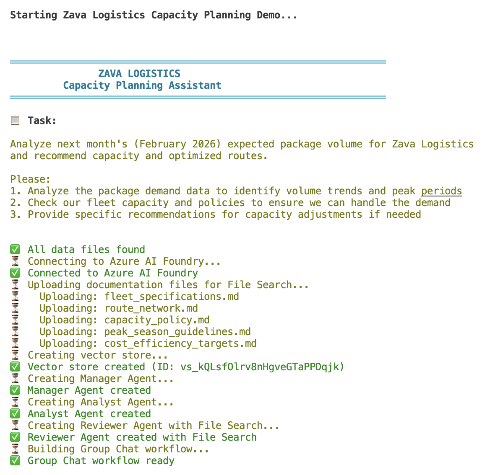
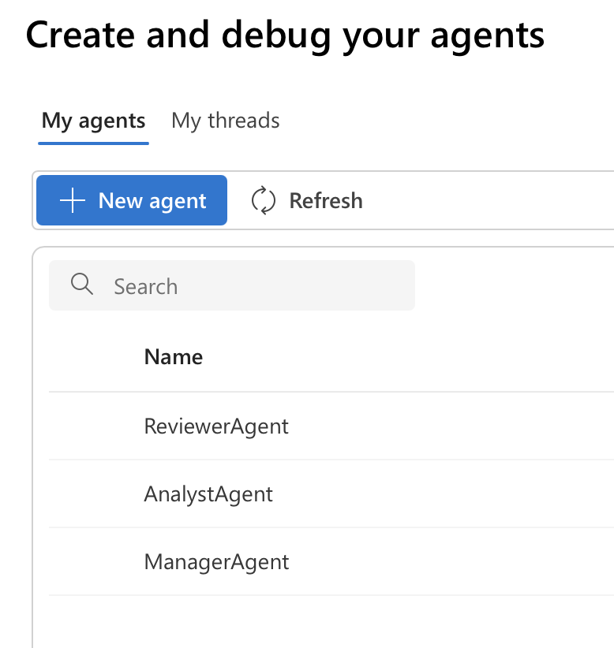

# Zava Logistics - Multi-Agent Capacity Planning Demo

A simple demo showing how multiple AI agents can collaborate using the **Microsoft Agent Framework Group Chat Pattern**.

## What This Demo Shows

Three AI agents work together to solve a capacity planning problem:

```
                    ┌─────────────────┐
                    │  MANAGER AGENT  │  ← Controls who speaks next
                    └────────┬────────┘
                             │
              ┌──────────────┴──────────────┐
              │                             │
              ▼                             ▼
      ┌──────────────┐              ┌──────────────┐
      │   ANALYST    │              │   REVIEWER   │
      │              │              │              │
      │ Analyzes CSV │              │ Searches     │
      │ demand data  │              │ policy docs  │
      └──────────────┘              └──────────────┘
```

**The Manager Agent** coordinates the conversation - it decides which agent should speak next and synthesizes the final recommendation.

## The Group Chat Pattern

In this pattern:
- A **Manager** agent controls the flow of conversation
- **Participant** agents each have specialized skills and tools
- All agents see the full conversation history
- The manager selects speakers until the task is complete

This is useful when you need agents to collaborate iteratively, building on each other's work.

## Prerequisites

- Python 3.10+ → [Download](https://www.python.org/downloads/)
- Azure CLI → [Install Guide](https://learn.microsoft.com/en-us/cli/azure/install-azure-cli)
- An Azure AI Foundry project with a deployed model (e.g., `gpt-5-mini`)

## Quick Start

### macOS / Linux

```bash
# 1. Navigate to project folder
cd /path/to/20260112_MAF

# 2. Create virtual environment
python3 -m venv venv

# 3. Activate it
source venv/bin/activate

# 4. Install dependencies
pip install --pre -r requirements.txt

# 5. Configure environment
cp .env.example .env
# Edit .env with your Azure AI Foundry endpoint and model name

# 6. Login to Azure (first time only)
az login

# 7. Run the demo
python main.py
```

### Windows

```powershell
# 1. Navigate to project folder
cd C:\path\to\20260112_MAF

# 2. Create virtual environment
python -m venv venv

# 3. Activate it
venv\Scripts\activate

# 4. Install dependencies
pip install --pre -r requirements.txt

# 5. Configure environment
copy .env.example .env
# Edit .env with your Azure AI Foundry endpoint and model name

# 6. Login to Azure (first time only)
az login

# 7. Run the demo
python main.py
```

### Run Again Later

```bash
# macOS/Linux
cd /path/to/20260112_MAF
source venv/bin/activate
python main.py

# Windows
cd C:\path\to\20260112_MAF
venv\Scripts\activate
python main.py
```

## Screenshots

**Setup** – Connects to Azure, uploads docs, creates agents:



**Agent Collaboration** – Manager coordinates Analyst and Reviewer:


**Azure AI Foundry** – Agents visible in the portal:



## Project Structure

```
├── main.py                      # Main script
├── data/
│   └── package_demand.csv       # Sample demand data for Analyst
└── docs/
    ├── fleet_specifications.md  # Documentation files
    ├── route_network.md         # for the Reviewer
    ├── capacity_policy.md       # to search through
    ├── peak_season_guidelines.md
    └── cost_efficiency_targets.md
```

## How to Adapt This for Your Use Case

1. **Change the agents** - Edit the instructions in `main.py` to fit your domain
2. **Change the data** - Replace the CSV with your own data
3. **Change the docs** - Replace the markdown files with your own documentation
4. **Adjust turns** - Change `MAX_TURNS` to control conversation length

## Key Code Pattern

```python
from agent_framework import GroupChatBuilder
from agent_framework.azure import AzureAIAgentClient

async with AzureAIAgentClient(async_credential=credential) as client:
    # Create your agents
    manager = await client.create_agent(name="Manager", instructions="...")
    analyst = await client.create_agent(name="Analyst", tools=["code_interpreter"], ...)
    reviewer = await client.create_agent(name="Reviewer", tools=["file_search"], ...)

    # Build the group chat
    workflow = (
        GroupChatBuilder()
        .set_manager(manager)
        .participants([analyst, reviewer])
        .build()
    )

    # Run it
    async for event in workflow.run_stream("Your task here"):
        # Handle events...
```

## Learn More

- [Microsoft Agent Framework Docs](https://learn.microsoft.com/en-us/agent-framework/overview/agent-framework-overview)
- [Group Chat Orchestration](https://learn.microsoft.com/en-us/agent-framework/user-guide/workflows/orchestrations/group-chat)
- [Azure AI Foundry Agents](https://learn.microsoft.com/en-us/azure/ai-foundry/agents/overview)
